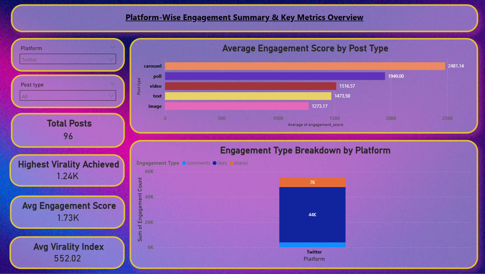
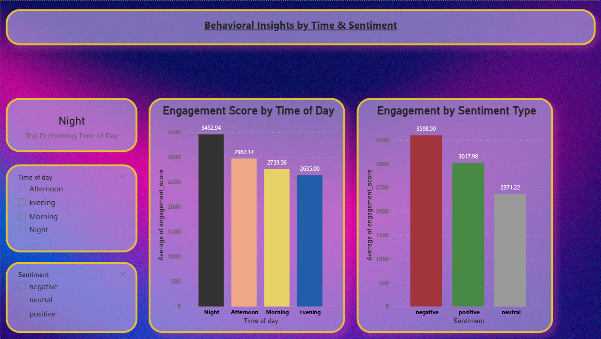
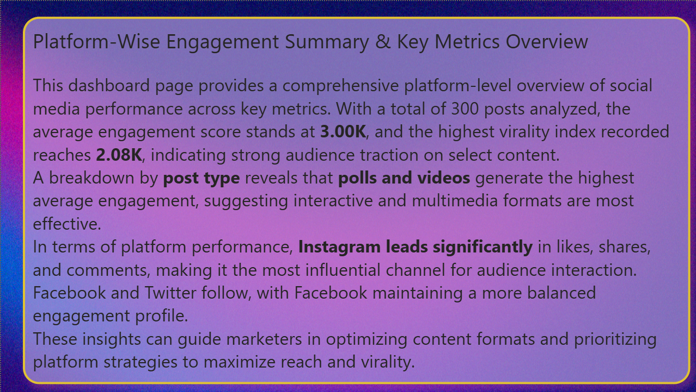
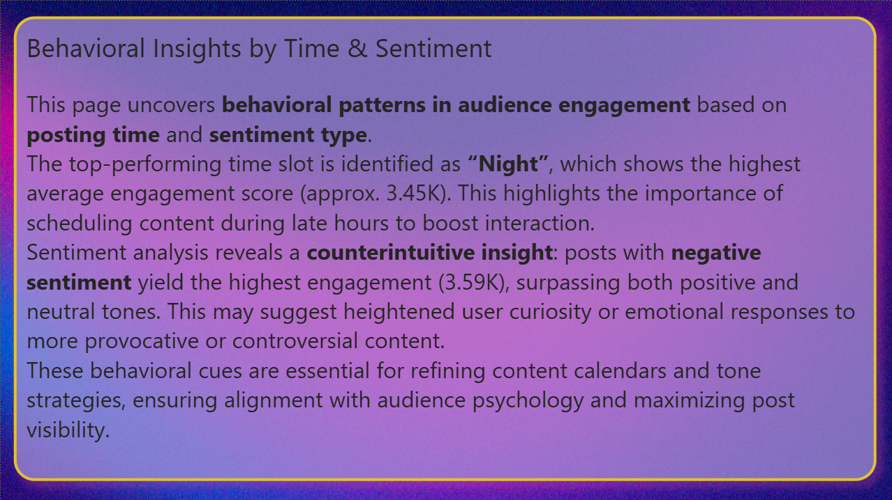

# social-media-engagement-dashboard
Power BI project analyzing platform-wise and behavioral engagement insights using social media data — includes post types, virality, and sentiment patterns.
# 📊 Social Media Engagement Dashboard (Power BI)

This project presents a visually-rich Power BI dashboard analyzing social media engagement across platforms, post types, time slots, and sentiment categories. Built as a portfolio case study, it uncovers actionable behavioral insights for digital marketers, brand managers, and social media analysts.

---

## 🔎 Project Objective

To analyze engagement trends across platforms (Instagram, Facebook, Twitter) and content types (video, poll, carousel, etc.) by evaluating:

- 💬 Post performance by **engagement score**
- 🕒 Behavioral patterns based on **time of day**
- 😐 Audience response categorized by **sentiment**
- 🔁 Platform-wise virality and shareability

---

## 📌 Dashboard Pages

### 🟣 Page 1: Platform-Wise Engagement Summary

- **Top-performing post types**: Polls & videos
- **Instagram** dominates in likes, comments, shares
- **Virality Index**: Highest observed at **2.08K**

🔍 *This view helps content teams prioritize platform-specific formats for maximum traction.*

---

### 🟪 Page 2: Behavioral Insights by Time & Sentiment

- **Best Time Slot**: *Night* (~3.45K average score)
- **Most engaging sentiment**: *Negative* (~3.59K)
- **Behavioral takeaway**: Late-night posts with strong emotional tone perform better.

🧠 *This view helps align content calendars with audience psychology.*

---

### 🟩 Executive Summaries

#### 📋 Page 1 Summary

#### 🧠 Page 2 Summary

---

## 🛠️ Tools Used

| Tool     | Purpose                          |
|----------|----------------------------------|
| Power BI | Data modeling & dashboard design |
| DAX      | Custom measures (Top Time Slot)  |
| Canva    | Presentation design & summaries  |

---

## 📂 Project Structure

---

## 📣 About the Author

> I’m passionate about turning raw data into actionable business insights. This project combines my skills in business analytics, storytelling, and Power BI to explore real-world trends in social media behavior.  
>  
> Feel free to connect on [LinkedIn](https://www.linkedin.com/in/raj-sharma-276349238/) for collaboration or feedback!

---

## 🔗 Related Tags for GitHub SEO

`#PowerBI` `#SocialMediaAnalytics` `#BusinessIntelligence`  
`#DataStorytelling` `#DashboardDesign` `#EngagementAnalysis`  
`#MarketingAnalytics` `#DAX` `#PortfolioProject`

